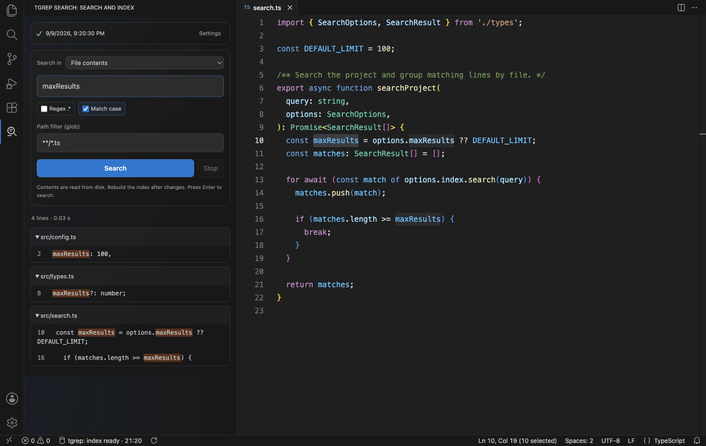

# tgrep Search



## Quickstart

1. Install **[Microsoft tgrep 1.0.5](https://github.com/microsoft/tgrep/releases/tag/v1.0.5)** and add it to PATH.
2. In **VS Code 1.95+**, run **Extensions: Install from VSIX…** and select the package for your OS and CPU. Builds are available as [GitHub Actions artifacts](https://github.com/disqurell/tgrep-search-vscode/actions/workflows/build.yml); Marketplace installation is not available yet.
3. Open **tgrep Search** from the Activity Bar or press **Cmd+Alt+F** / **Ctrl+Alt+F**.
4. Expand **Settings**. Choose your **source folder** and, independently, an **index folder outside the source folder**. The default index location also works.
5. Click **Build / update**, wait for ✓, then enter a query and press **Enter**. Click a result to open its line in the editor.

Only VS Code and tgrep are needed. If tgrep is not found, set **`tgrepSearch.executable`** to its executable path in VS Code settings.

[Документация на русском](README.ru.md)

## Search

- Search **file contents** with literal text, regular expressions and a match-case toggle.
- Narrow results with a **path glob**, such as `**/*.ts` or `!**/test/**`.
- Switch to **File names (glob)** to find files by name.
- Search selected text with **Cmd+Alt+Shift+F** / **Ctrl+Alt+Shift+F**, or from the editor context menu.

Settings start collapsed. The **✓ and last successful index update time** remain visible above search; **≈** marks an estimated external update time. Expand Settings to see both folder paths, rebuild or switch projects in a multi-root workspace.

## Settings

Open VS Code settings and search for **tgrep Search**.

| Setting | Purpose | Default |
| --- | --- | --- |
| `tgrepSearch.language` | Panel language: `auto`, `en`, `ru` | VS Code language |
| `tgrepSearch.executable` | tgrep executable path | `tgrep` |
| `tgrepSearch.maxResults` | Maximum matching lines or files | `1000` |
| `tgrepSearch.maxOutputMB` | Maximum search output in MiB | `8` |
| `tgrepSearch.externalLockPath` | Shared lock for an external updater | Beside the index |

## Before you use it

- **Rebuild after file changes.** Search reads saved files; indexing is manual.
- Hidden files are included when building; tgrep ignore rules still apply.
- You can connect an existing disk index without rebuilding. Its source folder must match. For cron or other external updates, follow the [shared-lock setup](docs/indexes.md#hidden-files-and-safe-rebuilding).
- Builds update the index in place. After a failed or cancelled build, run **Build / update** again before searching.
- This version supports single-line searches, without replacement. Results exceeding a limit are marked incomplete.

Packages cover **macOS, Linux, Alpine and Windows**, each for **x64 and ARM64**. Windows packages are experimental pending native runtime verification. Remote/WSL installations need the package and tgrep on the Extension Host system; browser-only VS Code is unsupported. See [platform requirements and verification](docs/development.md#platforms).

## Development

```sh
npm ci
npm test
npm run package
```

Building requires Node.js and a C compiler. The VSIX is written to `artifacts/`. See [build and test instructions](docs/development.md#build-and-test) and [index details](docs/indexes.md).
